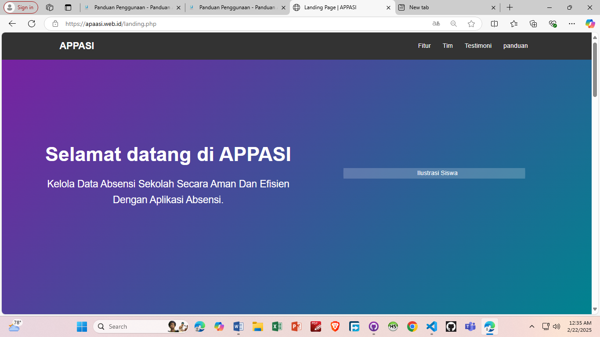
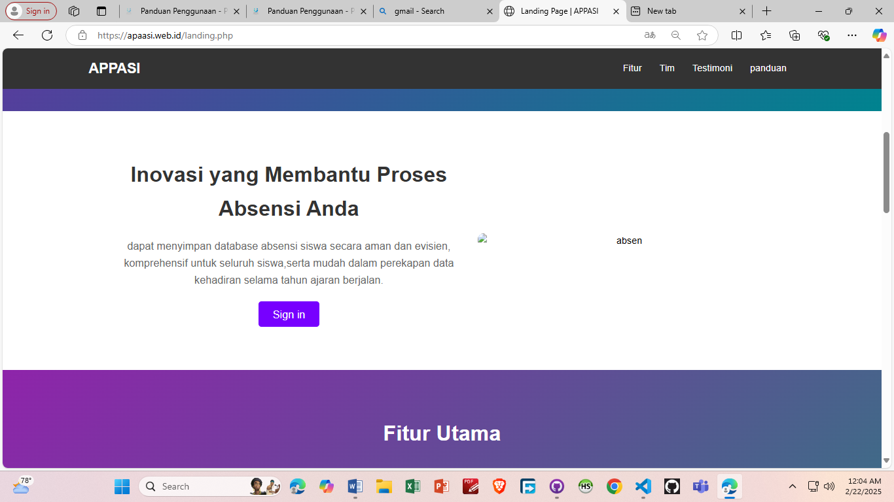
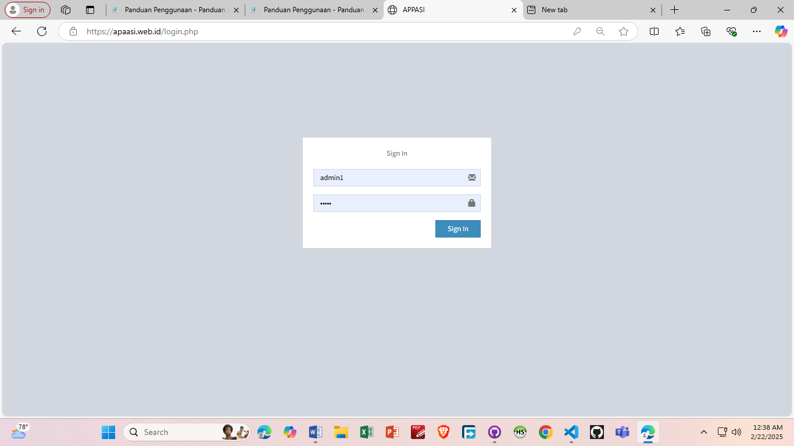
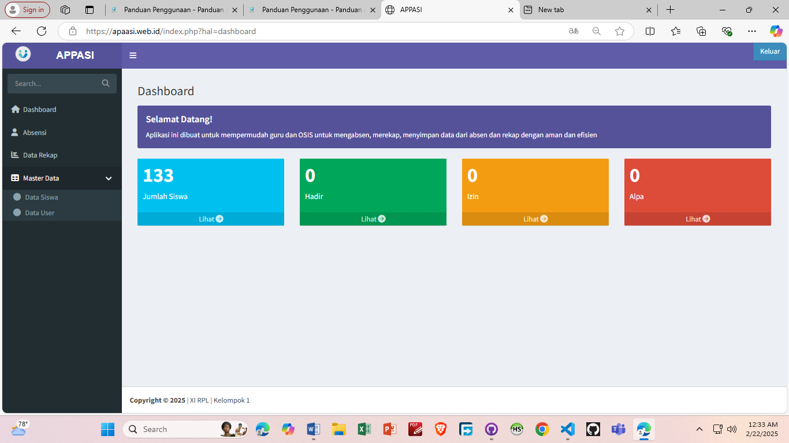
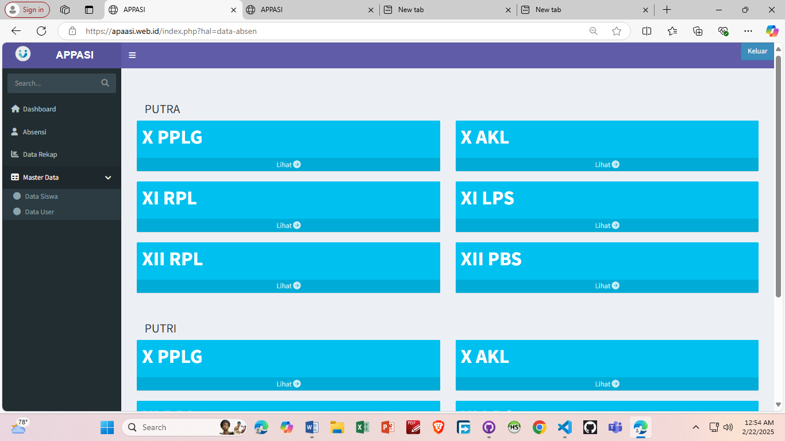
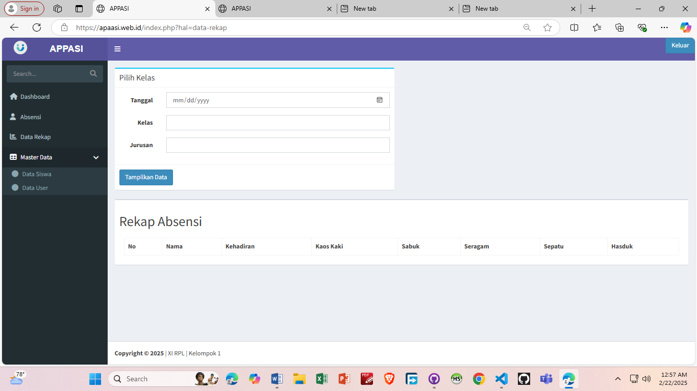

# Panduan Penggunaan

## Login dan Hak Akses

1. Untuk memulai aplikasi anda bisa membuka browser dan masukan alamat berikut [`https://apaasi.web.id/`](https://apaasi.web.id/).
2. Muncul tampilan halaman landing page aplikasi.

3. Scroll agak kebawah, lalu jika muncul tombol sign in tekan tombol **sign in** 
4. Masukkan Username `admin` dan password `appasi1` untuk login sebagai administrator.

5. Selamat anda masuk ke halaman dashboard.

6. Jika anda ingin mengabsen siswa, anda bisa langsung masuk di menu Absensi pada sidebar

7. Jika anda ingin melihat rekap siswa anda bisa langsung masuk di menu data rekap pada sidebar

8. Untuk keluar anda bisa klik menu **keluar** pada kanan atas pada sidebar.

